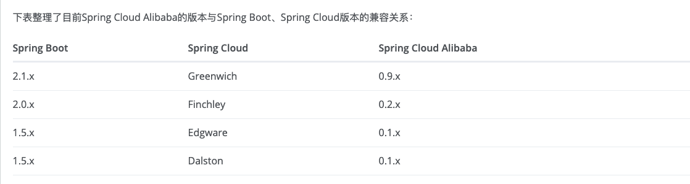
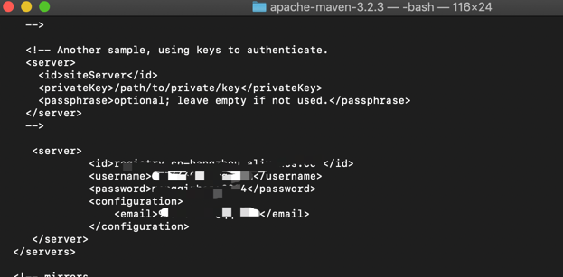
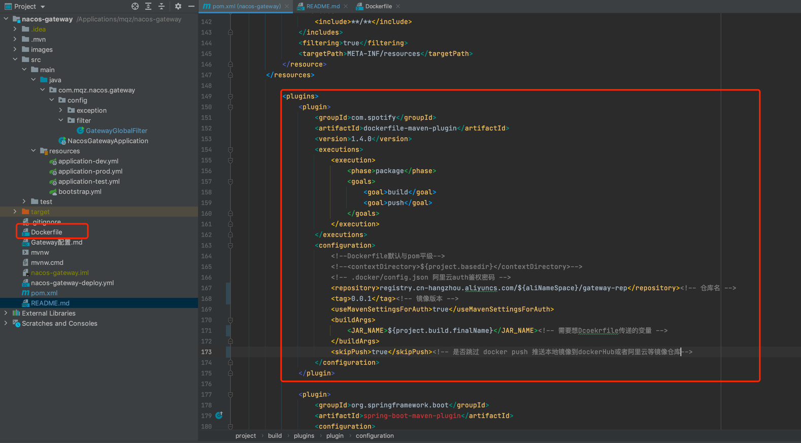

# Nacos+SpringCloudGateway

- 1.导入依赖：
    * nacos-config :配置中心
    * nacos-discovery :注册中心
    * gateway： 网关依赖
    
- 2.配置maven多环境，并且开启资源过滤，让maven加载到resources配置文件
    
- 3.配置注册中心：bootstrap.yml，该配置文件和nacos-consumer-a配置文件基本类似，除了config配置文件名称不一样

- 4.编写网关请求过滤转发配置，并且编写全局拦截器写一些定制化东西：
   * 比如拦截登录、解析token
   * 其他的服务模块需要写过滤器拦截，限制无token的请求，具体参考系统的业务需求。
   
- GatewayGlobalFilter:

- Routes配置:

#SpringBoot、SpringCloud、SpringCloudAlibaba三者版本兼容参考：

#dockerfile-maven-plugin 本地打包项目成镜像并推送到镜像仓库 这里需要参考maven多模块打包方式！！具体可看项目： https://github.com/DemoMeng/simple-life-better

    1.打包配置pom
    2.编写Dockerfile文件
    3.运行该插件的机器上定义DOCKER_HOST环境变量，配置访问Docker的URL， 
      如：export DOCKER_HOST=tcp://localhost:2375
      上面的例子，是在Linux环境下定义的DOCKER_HOST环境变量，因为Docker安装在本机上，因此使用localhost。如果你的Docker运行环境不在本机，
      请使用Docker所在机器的IP。2375是为Docker开启的远程访问API的端口，如果你开启的是其他端口，请使用具体的端口。如果你的Docker没有开启远程访问API，请自行Google开启。
    4.配置鉴权，在maven的setting.xml中新加一个server节点配置鉴权：
        <server>
          <id>registry.cn-hangzhou.aliyuncs.com</id>
          <username>xxxx</username>
          <password>xxxx</password>
          <configuration>
            <email>xxxx</email>
          </configuration>
        </server>

    5.执行打包构建： mvn clean package -DskipTests -Pdev
  
    注意：Dockerfile需要和pom文件平级

