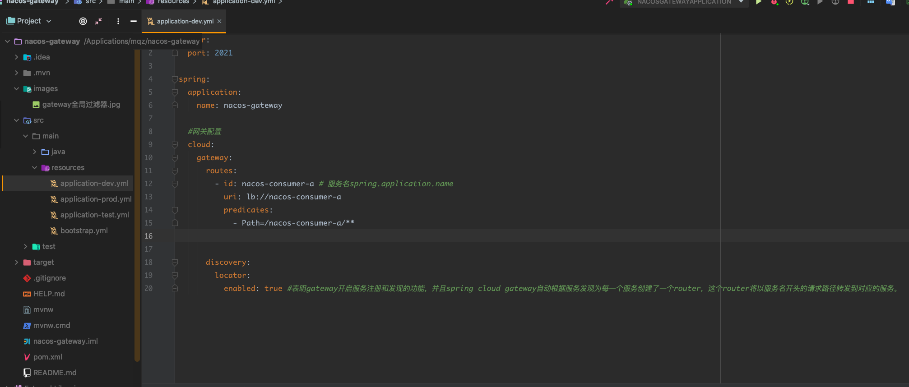

# Nacos+SpringCloudGateway

- 1.导入依赖：
    * nacos-config :配置中心
    * nacos-discovery :注册中心
    * gateway： 网关依赖
    
- 2.配置maven多环境，并且开启资源过滤，让maven加载到resources配置文件
    
- 3.配置注册中心：bootstrap.yml，该配置文件和nacos-consumer-a配置文件基本类似，除了config配置文件名称不一样

- 4.编写网关请求过滤转发配置，并且编写全局拦截器写一些定制化东西：
   * 比如拦截登录、解析token
   * 其他的服务模块需要写过滤器拦截，限制无token的请求，具体参考系统的业务需求。
   
- GatewayGlobalFilter:

- Routes配置:
